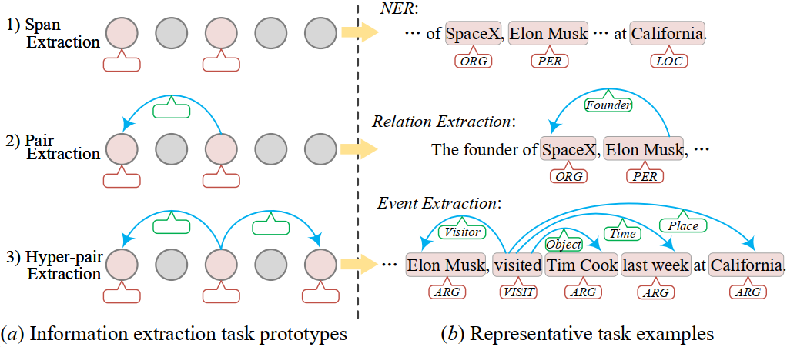
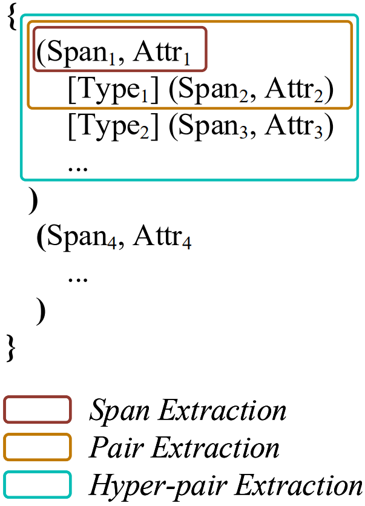
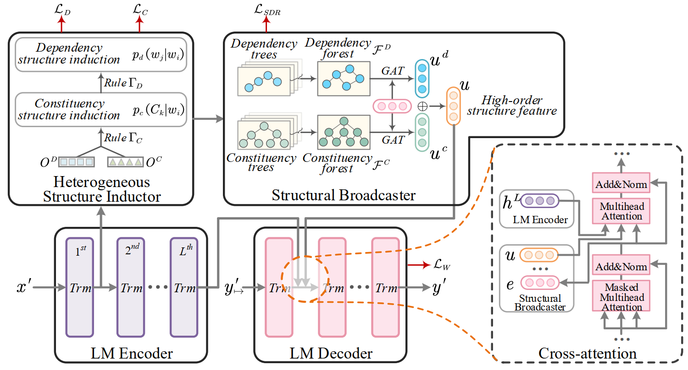
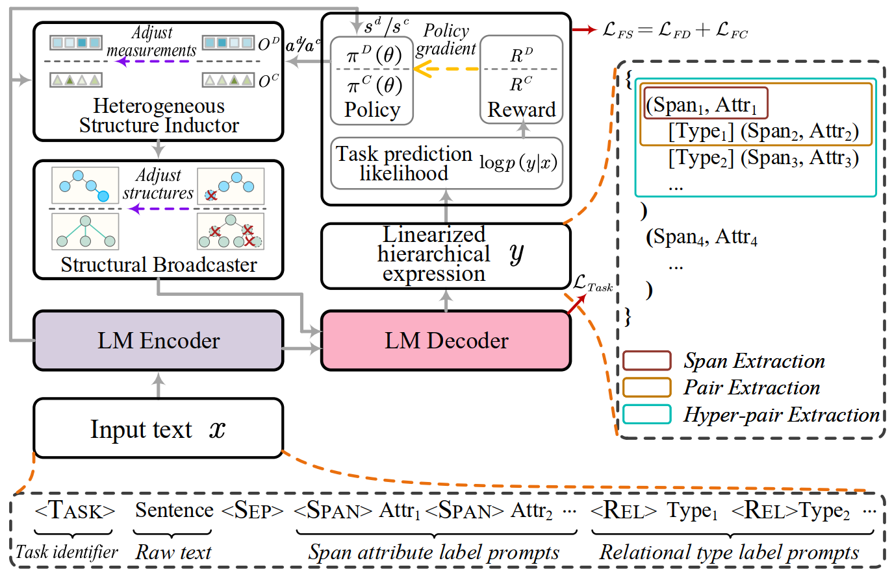

# LasUIE (Latent Adaptive Structure-aware LM for UIE)


**The pytroch implementation of the NIPS-2022 paper [Unifying Information Extraction with Latent Adaptive Structure-aware Generative Language Model](https://proceedings.neurips.cc/paper_files/paper/2022/hash/63943ee9fe347f3d95892cf87d9a42e6-Abstract-Conference.html)**.

----------

## 0. Online Demo Page is on


### Please visit [this site](#0-online-demo-page-is-on).

----------

## 1. Methodology Description 

### 1.1  Modeling Universal Information Extraction (UIE)

[UIE](https://aclanthology.org/2022.acl-long.395/) has been proposed to unify all information extraction tasks in NLP community, which converts the structure prediction of IE tasks universally into the sequence prediction via generative LMs.

All IE jobs essentially revolves around predicting two key elements: <**mention spans**> or/and their <**semantic relations**>.
In this project, we thus reduce all the IE tasks into three prototypes: **span extraction**, **pair extraction** and **hyper-pair extraction**:

<p align="center">
  
</p>


- I) Span Extraction, e.g., 
    - named entity recognition (NER)
    - aspect-based sentiment analysis (ABSA)
    - aspect-term extraction (ATE)
  
- II) Pair Extraction, e.g.,
    - relation extraction (RE)
    - aspect-opinion pair extraction (AOP)
    - aspect-based sentiment triplet extraction (ASTE)

- III) Hyper-pair Extraction, e.g., 
    - event extraction (EE)
    - semantic role labeling (SRL)
    - opinion role labeling (ORL) 


Under this scheme, **mention spans** are described with <*Span*> terms and the corresponding <*Span Attribute*> labels; 
**semantic relations** are straightforwardly denoted with <*Relation*> labels.

And all the IE structures are cast into a sequential representation: 
*Linearized Hierarchical Expression (LHE)*.
For example, 

<p align="center">
  
</p>

- in span extraction:
  -  *{ ( Span<sub>1</sub> , Attr<sub>1</sub> ) , ... , ( Span<sub>i</sub> , Attr<sub>i</sub> ) , ... }*


- in span extraction:
  -  *{ ... , ( Span<sub>i</sub> , Attr<sub>i</sub> [ Rel<sub>k</sub> ] Span<sub>j</sub> , Attr<sub>j</sub> ) ,  ... }*


- in span extraction:
  -  *{ ... , ( Span<sub>i</sub> , Attr<sub>i</sub> [ Rel<sub>k</sub> ] Span<sub>j</sub> , Attr<sub>j</sub> [ Rel<sub>m</sub> ] Span<sub>n</sub> , Attr<sub>n</sub> ,  ... ) ,  ... }*


### 1.2 UIE with Structure-aware Generative Language Model

As cast above, UIE has two key common challenges of IEs: 

- **Boundary Identification** of each span terms (for UIE-element-II: span extraction).

- **Long-range Dependence** between different span terms (for UIE-element-I: relation extraction);
  
We thus propose addressing the two challenges by modeling both the syntactic dependency structure and constituency structure,
where the constituency syntax mostly benefits the first challenge; 
the dependency structure well aids the second challenge.
To implement the above idea, we propose learning a *Latent Adaptive Structure-aware Generative Language Model* for UIE, aka, LasUIE.

LasUIE has a three-stage learning procedure:


<p align="center">
  
</p>

- Stage-I: **unsupervised generic pre-training**:
  - generally using an off-the-shelf well-trained generative LM (GLM), e.g., BART, T5.

- Stage-II: **unsupervised structure-aware post-training**:
  - *a newly introduced procedure in this project,* inserted between the pre-training and fine-tuning stages for structure learning.

- Stage-III: **supervised task-oriented structure fine-tuning**:
  - *a newly introduced procedure in this project,* along with the task-specific finetuning.


#### 1.2.1 Unsupervised structure-aware post-training

A Heterogeneous structure inductor (HSI) module is used to unsupervisedly enrich the backbone GLM with sufficient structural knowledge, reinforcing the awareness of linguistic syntax.

<p align="center">
  
</p>


#### 1.2.2 Supervised task-oriented structure fine-tuning

Further adjusting (finetune) the syntactic attributes within the GLM with stochastic policy gradient algorithm by directly taking the feedback of end task performance,
such that the learned structural features are most coincident with the end task needs.

<p align="center">
  
</p>


----------------


## 2. Code Usage 

### 2.1  Requirement Installation

- Step 1: install base envir
  ``` bash 
  conda create -n lasuie python=3.8
  ```

- Step 2: install pytorch
  ``` bash
   # CUDA 10.2
   conda install pytorch==1.10.0 torchvision==0.11.0 torchaudio==0.10.0 cudatoolkit=10.2 -c pytorch
  
   # CUDA 11.3
   conda install pytorch==1.10.0 torchvision==0.11.0 torchaudio==0.10.0 cudatoolkit=11.3 -c pytorch -c conda-forge
  ```

- Step 3: install other requirements
  ``` bash 
  pip install -r requirements.txt
  ```


### 2.2  Code Structure


```
│---------------------------------------------------
├─config                           // configuration fold
│    ├─config.json                 // config for generic finetune
│    └─config_struct_tune.json     // config for structural finetune
│
├─data                             // data fold
│  ├─hyperpair                     // dataset for hyperpair extraction 
│  │  └─orl                        // task name
│  │      └─mpqa                   // dataset name
│  │          ├─labels.json        // template labels for hyperpair extraction 
│  │          ├─dev.json           // template dev set for hyperpair extraction 
│  │          ├─test.json          // template test set for hyperpair extraction 
│  │          └─train.json         // template train set for hyperpair extraction 
│  │  
│  ├─pair                           // dataset for pair extraction 
│  │  └─re  
│  │      └─nyt  
│  │          └─...
│  │  
│  ├─span                          // dataset for span extraction  
│  │  └─ner  
│  │      └─conll03  
│  │           └─...
│  │  
│  └─post-training                 // corpos for post-training of the GLM
│      ├─books-corpus  
│      └─wikipedia-en  
│---------------------------------------------------
├─checkpoint                       // saving model checkpoints
│    └─...
├─logs                             // saving experiment logs
│    └─...
├─test_output                      // saving testing/inference outputs
│    └─...
├─figures                          
├─requirements.txt                 
├─README.md             
├─LICENSE  
│---------------------------------------------------
├─engine                           // core codes here 
│    ├─constants.py
│    ├─cus_argument.py
│    ├─data_utils.py
│    ├─evaluating.py
│    ├─module.py
│    ├─t5_modeling.py
│    └─utils.py
│
├─run_struct_post_train.py          // entry of second phase of structural post-training
├─run_finetune.py                   // entry of thrid phase of generic fine-tuning
├─run_finetune_with_struct_tune.py  // entry of thrid phase of structural fine-tuning
├─run_inference.py                  // entry of fourth phase of inference 
└---------------------------------------------------
```


### 2.3  Running Pipeline


The general pipeline goes as:

```javas
Step 1         run_struct_post_train.py  
                          ↓ 
Step 2            run_finetune.py (first train, then eval)
                          ↓
Step 3       run_finetune_with_struct_tune.py
                          ↓          
Step 4             run_inference.py
```


#### 2.3.1  Structure-aware post-training


- Please prepare the corpus for the post-training, as in 
`data/post-training/books-corpus `, 
`data/post-training/wikipedia-en`.


- Configurate the arguments in [cus_argument.py](engine%2Fcus_argument.py).


- Use an off-the-shelf GLM as backbone, e.g.,
  - BART:  [facebook/bart-base](https://huggingface.co/facebook/bart-base),   [facebook/bart-large](https://huggingface.co/facebook/bart-large), 
  - T5: [t5-base](https://huggingface.co/t5-base),   [t5-large](https://huggingface.co/t5-large),   [t5-large](https://huggingface.co/t5-large),  
  - Flan-T5: [google/flan-t5-base](https://huggingface.co/google/flan-t5-base),  [google/flan-t5-large](https://huggingface.co/google/flan-t5-large),  [google/flan-t5-xxl](https://huggingface.co/google/flan-t5-xxl),  


- Run post-training
  ```bash
  python run_struct_post_train.py
  ```
  


- Notes: runing [run_struct_post_train.py](run_struct_post_train.py) is optional. 
  - can directly make `2.3.2 finetuning` without post-training.  
  - recommended GPU requirement: >4 A100 (80G) GPUs.


#### 2.3.2  Supervised fine-tuning


**A. task-oriented fine-tuning**


- Choosing to use `ModelType.UIE` or `ModelType.LASUIE` (in [engine.constants.py](engine%2Fconstants.py)) as the model type.
    `ModelType.LASUIE` model is much time-consuming than `ModelType.UIE`.


- Configurate correctly all the arguments in [run_finetune.py#init_args()](run_finetune.py) and the [config.json](config%2Fconfig.json) file.


- Run starting finetune
  ```bash
  python run_finetune.py
  ```
  


**B. structure fine-tuning**


- Choosing `ModelType.LASUIE_STRUCT_TUNING` (in [engine.constants.py](engine%2Fconstants.py)) as the backbone model.


- Configurate [config_struct_tune.json](config%2Fconfig_struct_tune.json)


- Run starting structure-finetune
  ```bash
  python run_finetune_with_struct_tune.py
  ```
  

- Notes: runing [run_finetune_with_struct_tune.py](run_finetune_with_struct_tune.py) is time-consuming.
  - structural fine-tuning is optional, can use the generic fine-tuning ([run_finetune.py](run_finetune.py)) instead.
  - recommended GPU requirement: >2* A100 (80G) GPUs.


- Notes: making sure `B. structural-tuning` happens after `A. generic fine-tuning`, 
  because hard-start structural-tuning leads to non-convergence.


#### 2.3.3  Inference


- Configurate correctly the argument `model_checkpoint` with the well-trained model.


- Run starting inference
  ```bash
  python run_inference.py
  ```
  
- The outputs of predictions will be converted to the UIE structures, and be saved in `test_output` fold.


### 2.4 Dataset & Evaluating


#### 2.4.1 Dataset


- Prepare your own data in the template format of 
  `data/hyperpair`, `data/pair` or `data/span`.


- Configurate the `config/config.json` and `config/config_struct_tune.json` before runing the scripts.


#### 2.4.1 Evaluating


- During training (tuning), the monitoring metric is `rouge`, as it is a text generation process.
  - Only enable F1 metric monitoring when model produce stable predictions.
  

- The evaluation is based on exact match of `spans` and `triplets`, 
   feel free to customize the evaluation metrics in [engine/evaluating.py](engine%2Fevaluating.py).


-------------------------------------


## 3 MISC


### 3.1 Citation

If you use this work or code, please kindly cite:

```
@inproceedings{fei2022lasuie,
  author = {Fei, Hao and Wu, Shengqiong and Li, Jingye and Li, Bobo and Li, Fei and Qin, Libo and Zhang, Meishan and Zhang, Min and Chua, Tat-Seng},
  booktitle = {Advances in Neural Information Processing Systems},
  title = {LasUIE: Unifying Information Extraction with Latent Adaptive Structure-aware Generative Language Model},
  url = {https://proceedings.neurips.cc/paper_files/paper/2022/file/63943ee9fe347f3d95892cf87d9a42e6-Paper-Conference.pdf},
  pages = {15460--15475},
  year = {2022}
}
```

 

### 3.2 Acknowledgement

This code is partially referred from following projects or papers:
[UIE](https://github.com/universal-ie/UIE); 
[Structformer](https://arxiv.org/abs/2012.00857),
[Huggingface-T5](https://huggingface.co/transformers/v4.11.3/_modules/transformers/models/t5/modeling_t5.html).


### 3.3 License

The code is released under Apache License 2.0 for Noncommercial use only. 
Any commercial use should get formal permission first from authors.


### 3.4 Contact

For any question or issue, please contact 
[@Hao Fei](mailto:haofei37@nus.edu.sg) and
[@Shengqiong Wu](mailto:swu@u.nus.edu).


